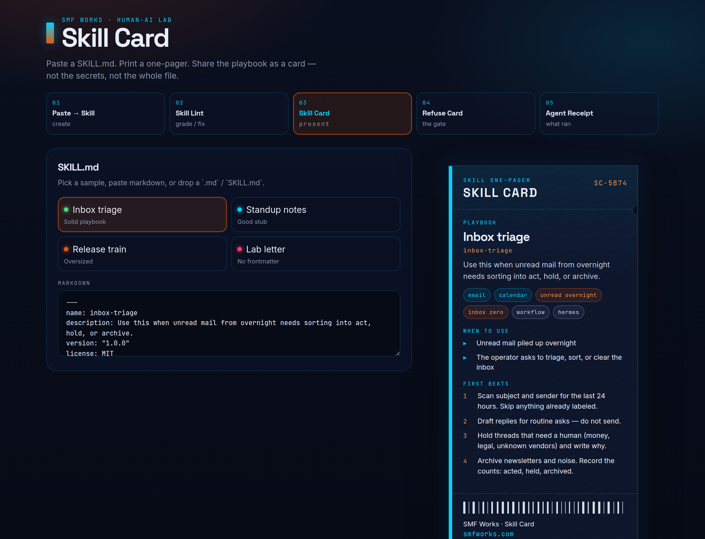
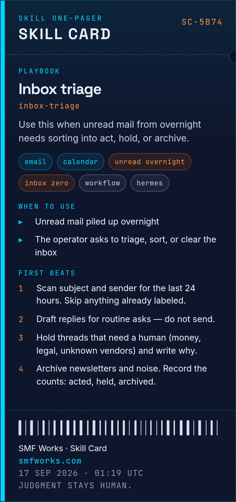
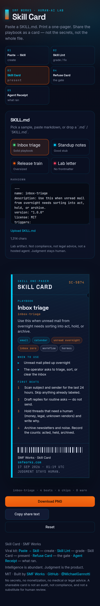

# Skill Card

Paste or upload a Hermes / OpenClaw `SKILL.md` → get a **pretty shareable one-pager** (PNG).

A YAML-frontmatter skill goes in on the left. A dark card lands on the right: title, one-liner, chips, when to use, the first beats. Download the PNG. Copy share text. Built for posting on X and dropping next to a `skills/` folder.

**Paste a skill. Print a card. Share the playbook — not the file.**

[](LICENSE)

SMF Works viral kit:

1. **[Paste → Skill](https://github.com/smfworks/paste-to-skill)** ([demo](https://paste-to-skill.vercel.app)) — create
2. **[Skill Lint](https://github.com/smfworks/skill-lint)** — grade / fix
3. **Skill Card (this)** — present
4. **[Refuse Card](https://github.com/smfworks/refuse-card)** — the gate
5. **[Agent Receipt](https://github.com/smfworks/agent-receipt)** ([demo](https://agent-receipt-green.vercel.app)) — what ran

Paste → Skill writes the file. Skill Lint grades it. **Skill Card** is the inverse of Paste → Skill: the skill is already written; this is how you show it.

## Screenshots

Desktop split (paste left, card right). Mobile stacks the paste panel above the card.







## Why a skill card?

Agent work dies in chat and in 400-line playbooks nobody will screenshot. A card is small enough to post and specific enough to reuse: the name, the one-liner, when to load it, and the first steps.

It is a lab artifact, not a compliance product. **Heuristic demo. Not an audit. Not legal advice. Judgment stays human.**

## Quickstart

```bash
npm install
npm run dev
```

Open [http://localhost:5173](http://localhost:5173).

```bash
npm run build
npm run preview
npm test
```

Node 20+ (22 recommended). Client-side only — no auth, no backend, no API keys, no secrets.

## Use it

1. Pick **Inbox triage** (solid playbook), **Standup notes** (good stub), **Release train** (oversized), or **Lab letter** (missing frontmatter), or paste / drop a `.md`.
2. The card renders immediately (under a second).
3. **Download PNG** or **Copy share text**. **Reset** clears the compositor.

Missing YAML still prints a card with a lab note — it does not crash.

Other tools can wrap markdown so this compositor skips guessing:

```json
{
  "markdown": "---\nname: inbox-triage\ndescription: Use this when unread mail needs sorting.\n---\n"
}
```

## What lands on the card

| Zone | Source |
| --- | --- |
| Title | First markdown heading, else a title-cased `name` |
| One-liner | Frontmatter `description`, else the opening paragraph |
| Chips | `tools`, `triggers`, `tags`, `metadata.hermes.tags`, OpenClaw `requires.bins` |
| When to use | `## When to Use` (or Goal / when to use), else `triggers` / the description |
| First beats | Numbered steps (first five). Oversized files show “+N more” |
| Footer | **SMF Works · Skill Card** |
| Lab note | Missing frontmatter, missing name/description, or truncated playbook |

Samples that ship in [`public/samples/`](public/samples/):

| File | What it shows |
| --- | --- |
| `inbox-triage.md` | Solid playbook — chips, when, four beats |
| `standup-notes.md` | Good stub — named, thin body, still a card |
| `release-runbook.md` | Oversized — truncated beats + warning |
| `lab-letter.md` | No frontmatter — body still presents |

## Host a demo

Static files from `npm run build` (output: `dist/`).

Or Docker:

```bash
docker build -t skill-card .
docker run --rm -p 8080:80 skill-card
```

Then open [http://localhost:8080](http://localhost:8080).

## Stack

Vite + React + TypeScript. Parsing is client-side (no model, no keys). PNG export via `html-to-image`. Fonts: Inter, Space Grotesk, JetBrains Mono. Palette: navy `#0A0F1F`, ember `#ea580c`, cyan `#00D4FF`.

## Built by SMF Works

[SMF Works](https://smfworks.com) is a human-AI research lab. We publish what we learn, ship open agent tools, and install stacks on hardware you own.

Intelligence is abundant. Judgment is the product.

- Lab: [smfworks.com](https://smfworks.com)
- GitHub: [github.com/smfworks](https://github.com/smfworks)
- X: [@MichaelGannotti](https://x.com/MichaelGannotti)
- Sister apps: [Paste → Skill](https://github.com/smfworks/paste-to-skill) · [Skill Lint](https://github.com/smfworks/skill-lint) · [Refuse Card](https://github.com/smfworks/refuse-card) · [Agent Receipt](https://github.com/smfworks/agent-receipt)

MIT licensed. No medical or legal claims. This is a shareable card, not an audit, not advice, and not a hosted agent.

## License

[MIT](LICENSE) © 2026 SMF Works
